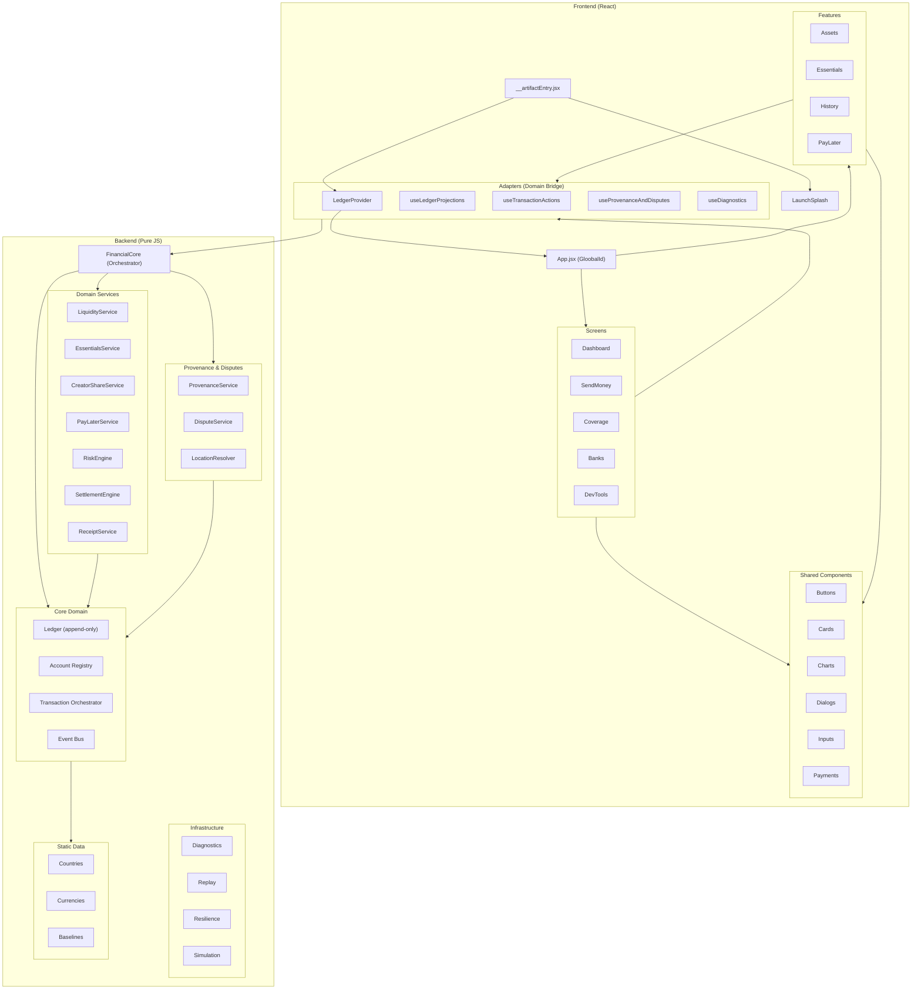
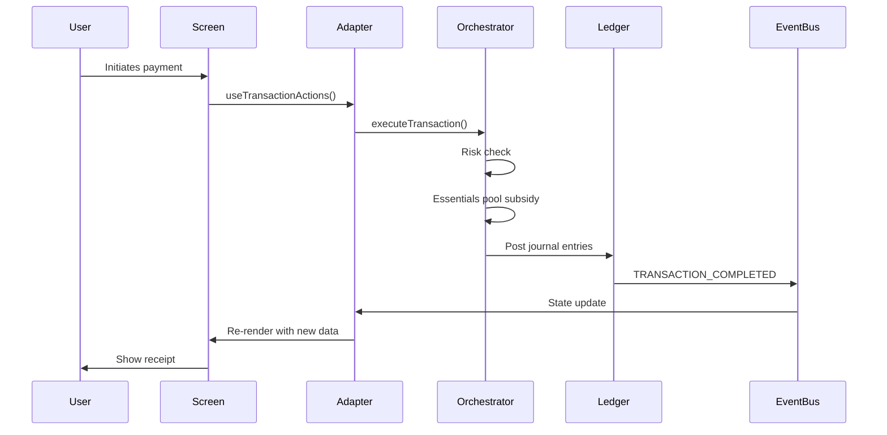

# Gloobal Architecture

## System Overview

## Data Flow

## Module Dependency Layers

| Layer | Depends On | Contains |
|-------|-----------|----------|
| **Frontend Screens** | Components, Adapters | Dashboard, SendMoney, Coverage, etc. |
| **Frontend Components** | Theme constants, Utils | Buttons, Cards, Dialogs, etc. |
| **Frontend Adapters** | Backend FinancialCore | LedgerProvider, custom hooks |
| **Backend FinancialCore** | All domain services | Factory/orchestrator |
| **Backend Domain Services** | Core domain, Events | Risk, Settlement, PayLater, etc. |
| **Backend Core Domain** | Shared, Data | Ledger, Accounts, Events |
| **Backend Shared** | Nothing | Money, IDs, ChainStore |
